During my free time I love to draw. Here are some of the drawings I have done in the past couple years:

<html>

  

    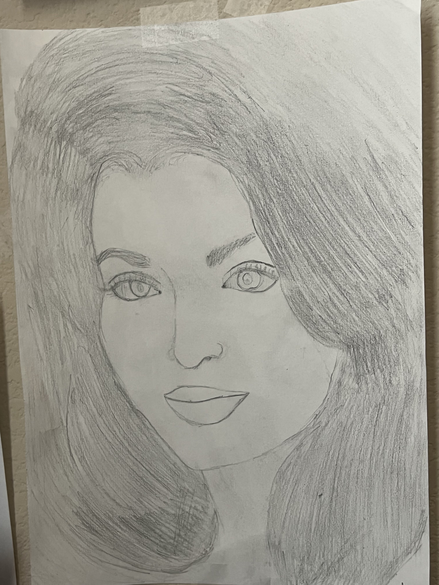  
    

  

    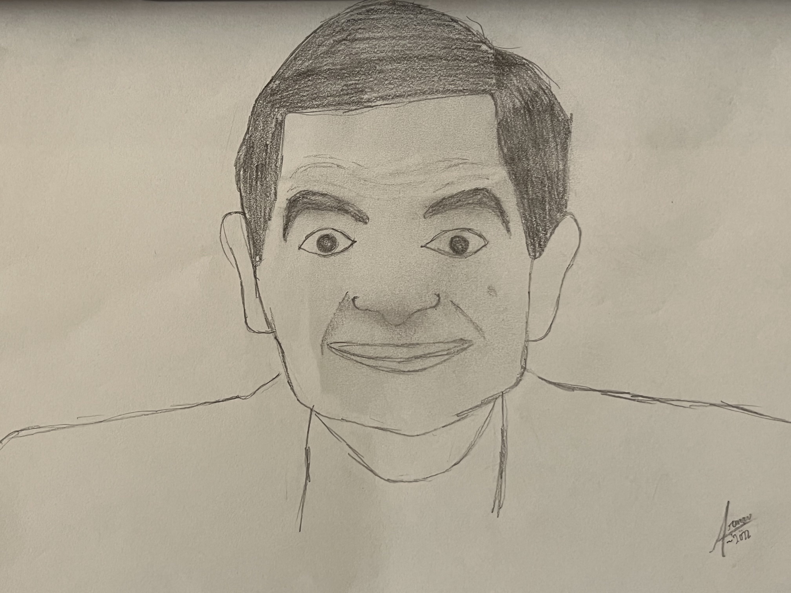
  

  

    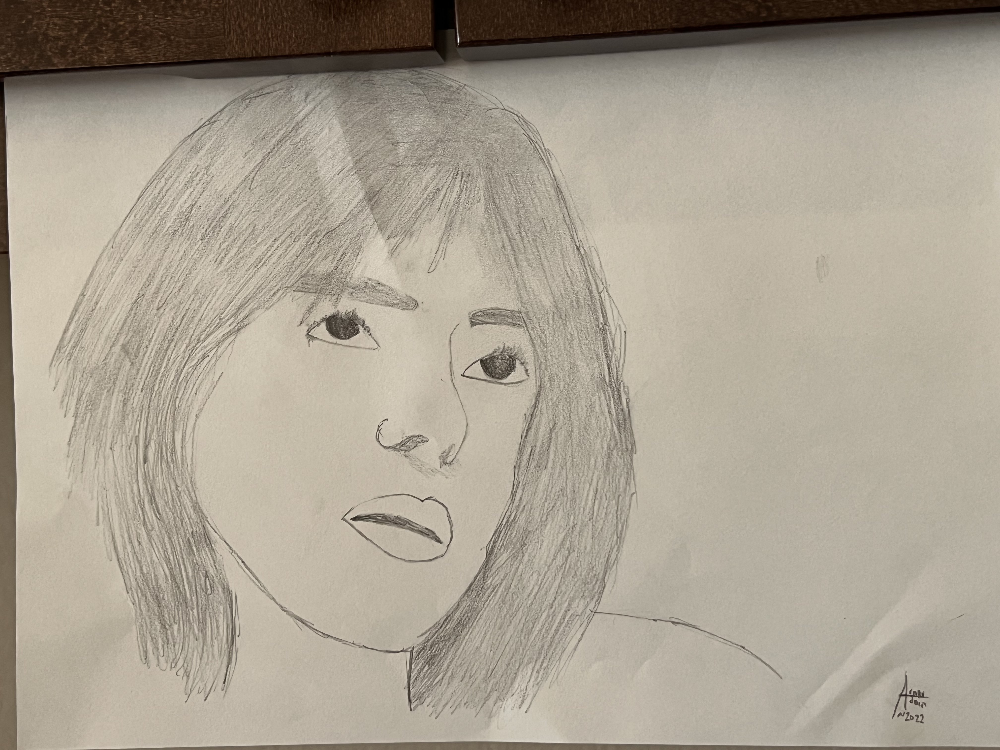
  

    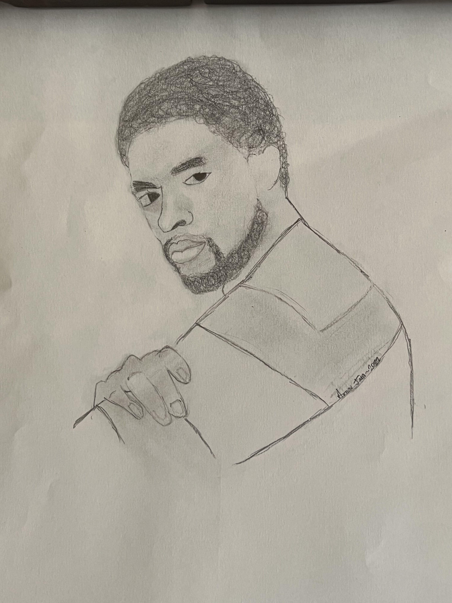
  

  

    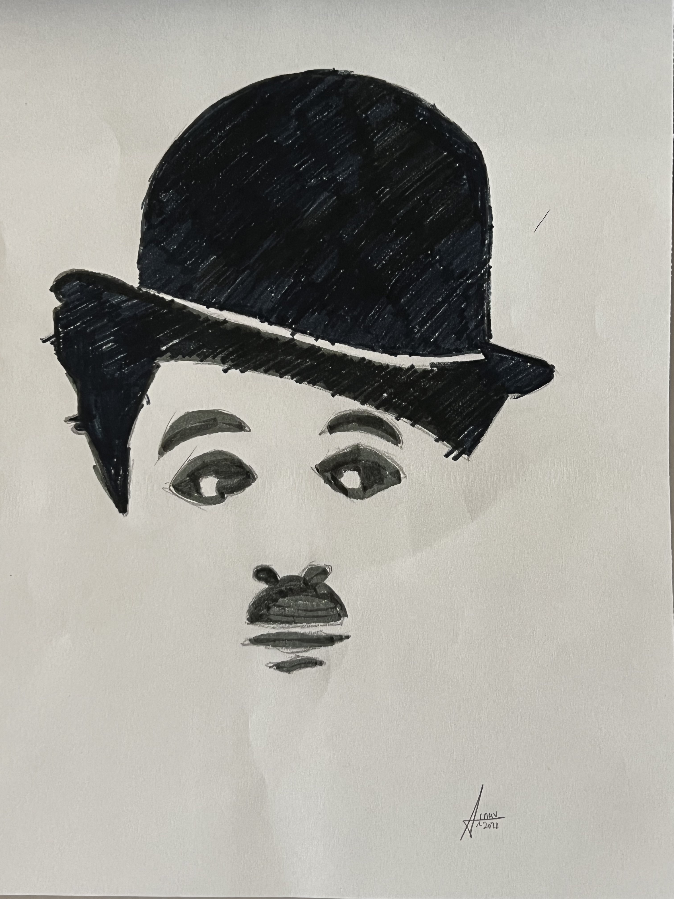
  

    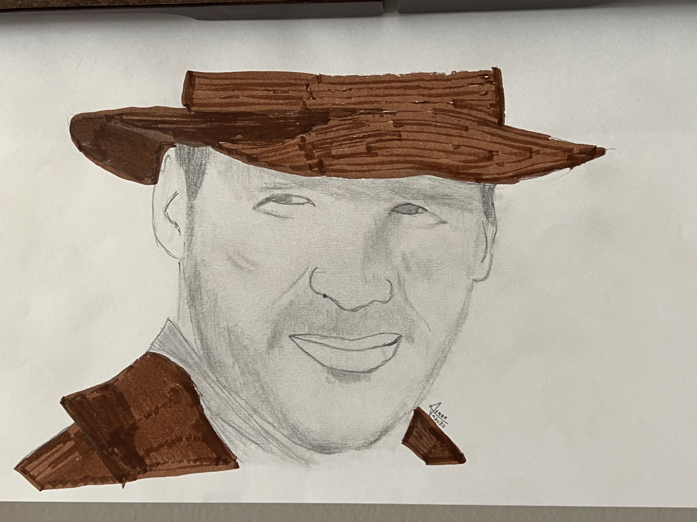
  

  

    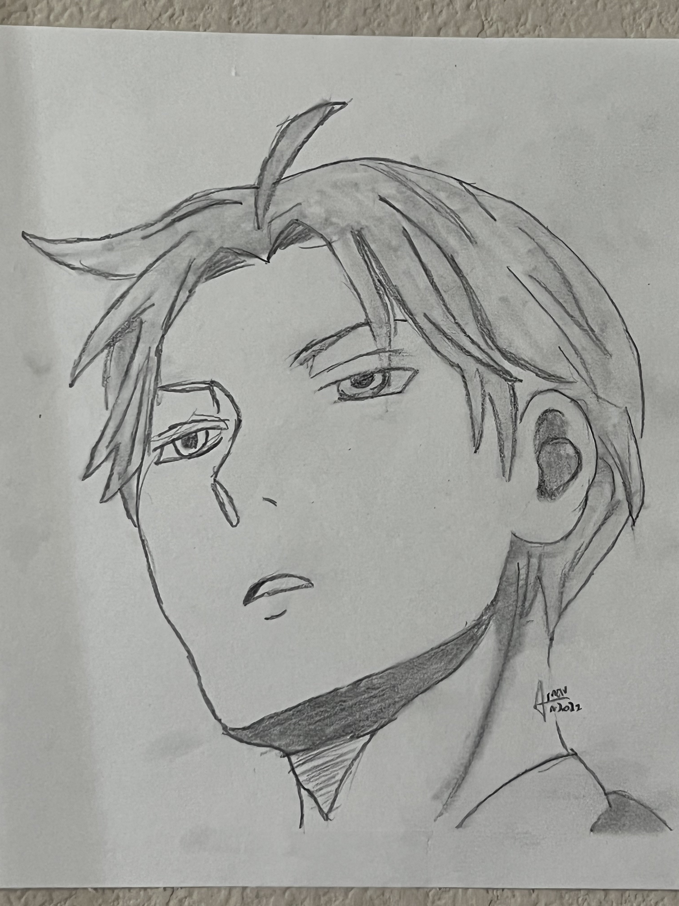
  

    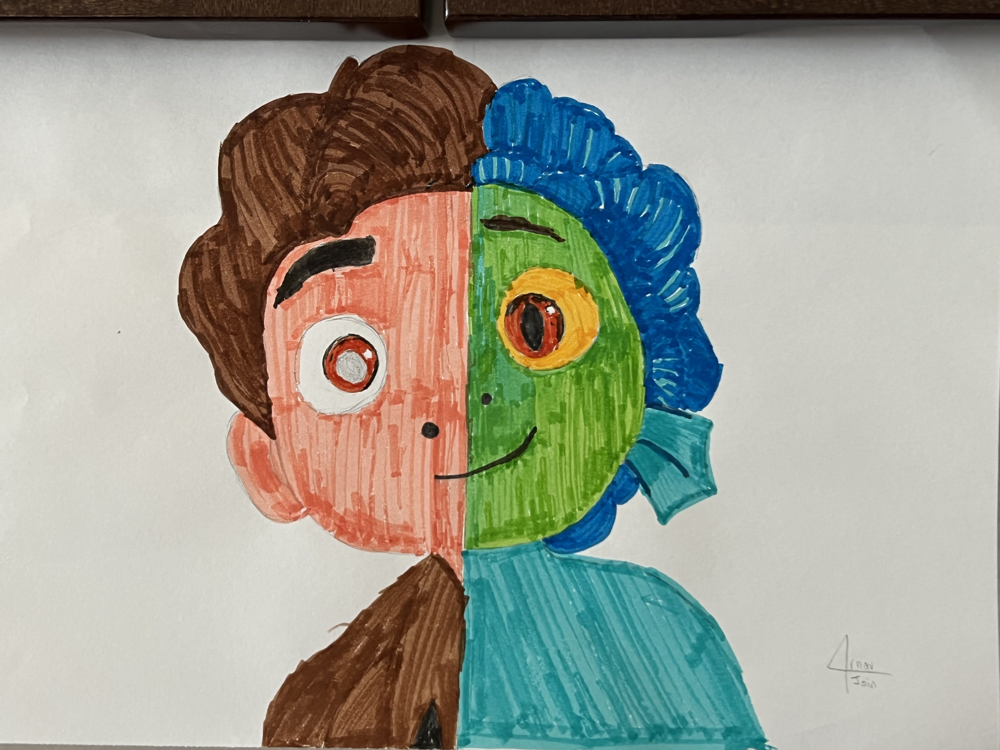
  

  

    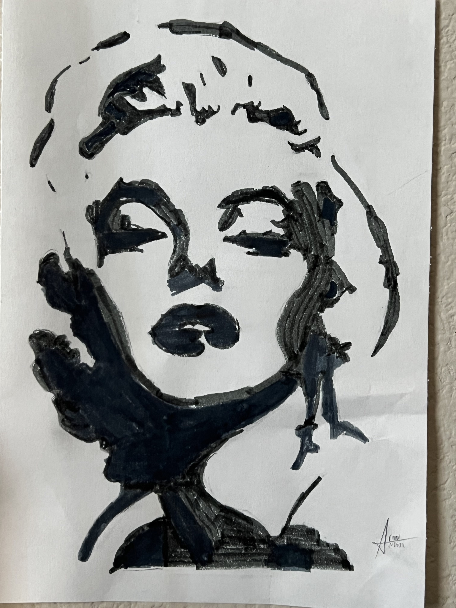
  

    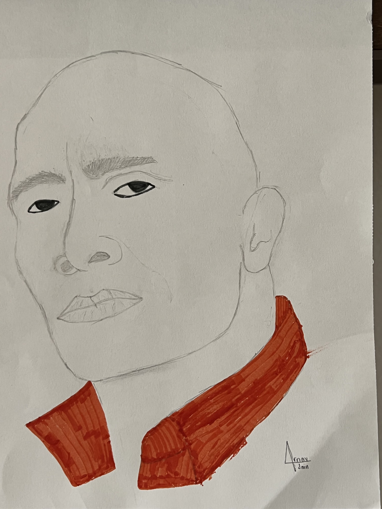
  

</html>

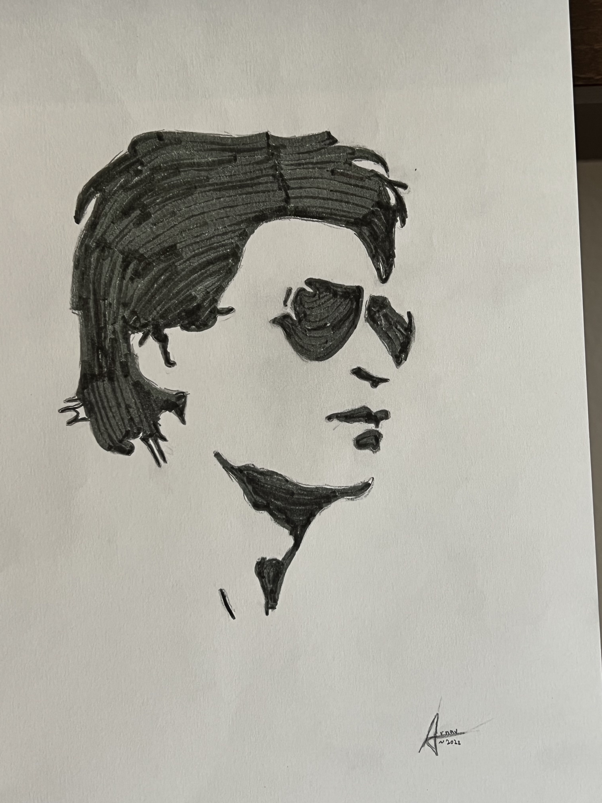

